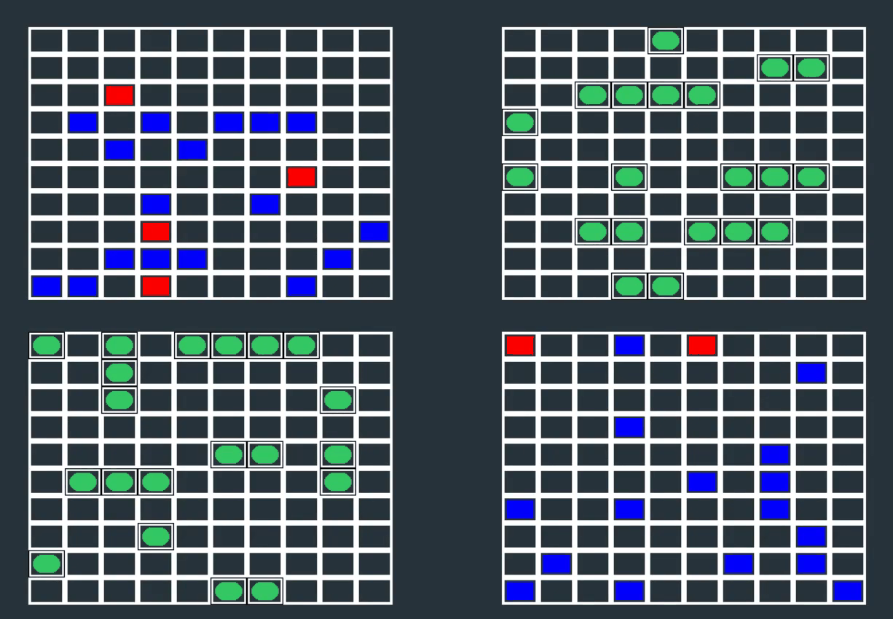

# 🚢 Battleship IA

  

Welcome to **Battleship IA**, an interactive battleship game designed with Python. Utilizing numpy for mathematical operations and the Pygame framework for game interactions, this game is structured exclusively for AI vs. AI gameplay. Due to time constraints during development, the ability for human players to participate has not been implemented.

## 🎮 Features

- **Programming Language**: Entirely coded in Python.
- **Frameworks and Libraries**: Utilizes numpy for mathematical operations and Pygame for managing game interactions.
- **Object-Oriented Design**: Features classes and inheritance, structuring the game entities as `Player` classes that exhibit inheritance.
- **Artificial Intelligence**: Offers an AI opponent powered by a Monte Carlo simulation to make strategic decisions.
- **Graphics**: Simple yet intuitive graphical interface to enhance game visualization.

## 📐 Game Rules

The game sets up with a variety of ships, each differing in length. All gameplay is managed by the computer, modeling strategic decision-making and random placement:

- **Total Ships**: 10 ships per AI player.
- **Ship Types**:
  - Four 1-tile ships
  - Three 2-tile ships
  - Two 3-tile ships
  - One 4-tile ship
- **Placement Rules**: Ships may not collide or be adjacent to each other, including at the sides and diagonals.
- **Random Placement**: Initial positions of the ships are randomly assigned at the start of the game.

## 🧠 AI Player: Monte Carlo Simulation

The AI in **Battleship IA** uses a Monte Carlo simulation to enhance its strategic gameplay. This method helps the AI optimize its moves based on probability and randomness, simulating numerous possible game scenarios rapidly.

### How It Works

1. **Initialization**: When the AI player (`MonteCarloPlayer`) starts, it inherits the setup from the basic player class, setting up its own game board and ship placement.
2. **Analyzing Hits**: The AI examines its board to update the sizes of the remaining ships based on the locations it has successfully hit (`"H"`).
3. **Simulating Scenarios**: Using its understanding of the board, the AI simulates numerous random placements of the remaining ships on the board. This simulation considers the possible orientations and positions where the ships can be without colliding with known misses or hits.
4. **Decision Making**:
   - The AI performs a set number of simulations, each involving a sequence of shots fired at random or calculated positions.
   - After each simulation, it assesses which positions most frequently result in hits.
   - The AI uses statistical data gathered from these simulations to choose the most probable successful shot for its next move.
5. **Adaptive Strategy**: As the game progresses, the AI adjusts its strategy based on new hits and misses, continually refining its model of the opponent's ship placements.

### Benefits of Monte Carlo Simulation

- **Adaptability**: The AI can adapt its strategy in real-time based on the ongoing state of the game.
- **Predictive Accuracy**: By simulating many possible outcomes, the AI improves its chances of predicting the opponent's ship locations.
- **Strategic Depth**: This approach allows the AI to make more informed decisions, potentially outsmarting human intuition with calculated probabilities.

## 🚀 Getting Started

To run **Battleship IA**, you will need Python and the Pygame library installed on your system. Follow the installation instructions for each, then download or clone this repository to get started.

## 🤝 Contributing

While the current version of the game is limited to AI vs. AI gameplay, contributions towards integrating human player functionality are welcome. Please fork the repository, make your changes, and submit a pull request.

Happy gaming! 🎉

